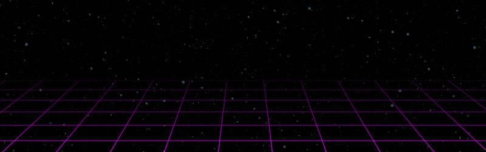

  

  
  
  <a href="https://discord.com/users/588284768064503809" target="_blank">
    
  

<!-- 

  

 -->

<h1 align="center">
  Welcome to my Github!
  
</h1>

  

---

<h3 align="start">👩‍💻 About Me</h3>

I'm a tech enthusiast passionate about Data Science, Machine Learning, and building impactful applications. I love turning complex data into actionable insights.

---

<h3 align="start">🛠️ Languages & Tools</h3>

  
  
  
  
  
  
  
  
  
  
  
  
  
  

---

<h3 align="center">🔥 My Stats</h3>

  
   
  
   
  

---

  

